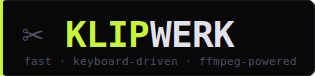

<div align="center">



**clips, sequences, trim, crop, convert**

[](https://github.com/Reaaaaa/klipwerk/actions/workflows/ci.yml)
[](https://www.python.org/)
[](https://pypi.org/project/PyQt6/)
[](LICENSE)
[](tests/)
[](https://github.com/Reaaaaa/klipwerk)

<br/>

*Drop in a video. Mark in and out. Draw a crop. Export. Nothing else.*

<br/>

<!-- Replace with an actual screenshot/GIF once you have one -->
<!--  -->

</div>

---

## Why KLIPWERK?

Most video editors are built around complex timelines with dozens of tracks. KLIPWERK focuses on one thing: cutting and cropping clips as fast as possible.
Export clips individually or stitch them into a sequence. Every action is keyboard-first, and the interface stays out of your way.
Import a video, crop exactly what you need with pixel-precise controls, and export it as a video or a GIF in seconds, supporting multiple formats and modern codecs like H.265, AV1, and WebM.

Under the hood, KLIPWERK is a thin wrapper around `ffmpeg`. It works with standard formats and keeps your workflow simple and transparent.

---

## Features

| | |
|---|---|
| **Live preview** | OpenCV-powered frame display with drag-to-crop, rule-of-thirds overlay, and aspect-ratio presets |
| **Waveform scrubber** | Timeline with waveform visualization (numpy-vectorized peak extraction), hover thumbnails, and I/O markers |
| **Clip list** | Drag-to-reorder, rename, undo/redo (command-pattern, no full list copies per edit) |
| **Sequence export** | Concatenate any number of clips into one video in a single click |
| **Stream-copy fast path** | No crop + all positive durations → skips re-encoding entirely, making exports significantly faster |
| **7 output formats** | H.264, H.265, AV1, VP9 across MP4, MKV, WebM |
| **Animated GIF export** | One click from any clip or the full sequence — two-branch palette filter (palettegen + paletteuse) for best-in-class 256-colour quality. FPS: 8/12/15/24. Width: 320/480/640/original. Tiered 15 s / 30 s duration safety. |
| **Rich media info** | ffprobe panel: codec, container, bitrate, color space, pixel format, duration |
| **Settings persistence** | Window geometry, export defaults, format/CRF/preset survive restarts via `QSettings` |
| **Frameless chrome** | Custom title bar with proper resize handles on all edges |
| **Zero config** | Drop `ffmpeg`/`ffprobe` next to the script or put them on `$PATH` — done |

> [!NOTE]
> KLIPWERK is a **cut-and-crop tool**, not a full media player. The waveform in the scrubber is a visual orientation aid — it helps you spot audio peaks so you can land on the right frame faster. Audio playback in the preview is intentionally out of scope; for a quick listen while you work, run your system's media player alongside KLIPWERK.

---

## Installation

### From source

```bash
git clone https://github.com/Reaaaaa/klipwerk
cd klipwerk
pip install -e .
klipwerk
```

### ffmpeg

KLIPWERK calls your existing `ffmpeg` installation — nothing is bundled. It searches in this order: `$PATH` → package directory → `./bin/` → `~/Documents/ffmpeg/` → `C:\ffmpeg\bin\` → `C:\Program Files\ffmpeg\bin\`.

| Platform | How to get ffmpeg |
|---|---|
| **Windows** | [gyan.dev/ffmpeg/builds](https://www.gyan.dev/ffmpeg/builds/) → `ffmpeg-release-essentials.zip` → drop `ffmpeg.exe` + `ffprobe.exe` next to the package or on `%PATH%` |
| **Linux** | `sudo apt install ffmpeg` |
| **macOS** | `brew install ffmpeg` |

---

## Keyboard shortcuts

| Key | Action |
|---|---|
| `Space` | Play / pause |
| `I` | Set **In** marker at current frame |
| `O` | Set **Out** marker at current frame |
| `Shift`+`I` | Jump to **In** marker |
| `Shift`+`O` | Jump to **Out** marker |
| `C` | Add clip from In → Out |
| `←` / `→` | Step one frame |
| `Shift` + `←` / `→` | Step ten frames |
| `Scroll wheel` on preview | Step one frame (up = back, down = forward) |
| `Shift` + `Scroll wheel` | Step ten frames |
| `Ctrl`+`Z` | Undo |
| `Ctrl`+`Y` / `Ctrl`+`Shift`+`Z` | Redo |
| `Delete` | Delete active clip |

---

## CLI flags

```
klipwerk              # launch the editor
klipwerk --version    # print version and exit
klipwerk --help       # show flag summary
klipwerk --reset-settings  # clear saved preferences
```

---

## Development

```bash
pip install -e ".[dev]"

pytest                       # run all 125 tests
pytest -v                    # verbose output
ruff check klipwerk          # lint
mypy klipwerk                # type-check

# Headless (CI / no display)
QT_QPA_PLATFORM=offscreen pytest -q
```

CI runs the full matrix on every push: **Ubuntu × Windows × macOS** × **Python 3.10, 3.11, 3.12**.

---

## Project layout

```
klipwerk/
├── __main__.py           # entry point, CLI flag parsing
├── app.py                # main window orchestration
├── history.py            # command-pattern undo/redo
├── sidebar.py            # export controls panel builder
├── settings.py           # QSettings facade
│
├── core/
│   ├── models.py         # Clip dataclass + CropRect
│   ├── ffmpeg_runner.py  # binary lookup, platform flags, subprocess
│   ├── probe.py          # ffprobe wrapper
│   ├── formats.py        # 7 FormatSpec entries + codec arg builder
│   └── export_builder.py # pure-function planner, fast-copy decision
│
├── widgets/
│   ├── preview.py        # live video preview + crop drag
│   ├── scrubber.py       # timeline scrubber with waveform
│   ├── seq_preview.py    # standalone sequence preview window
│   ├── clip_item.py      # sidebar list row + timeline tile
│   ├── guarded.py        # scroll-safe QSpinBox / QComboBox
│   └── helpers.py        # styled label / button / separator
│
├── workers/
│   ├── ffmpeg_worker.py  # QThread for export (with cancel + kill escalation)
│   ├── waveform.py       # vectorized peak extraction
│   └── thumbnail.py      # scrubber hover thumbnails
│
└── ui/
    ├── theme.py          # dark palette + Qt stylesheet
    └── icons.py          # SVG → QIcon with lru_cache
```

---

## Architecture highlights

- **Pure-function export planner** (`SequencePlan`) — the fast-copy decision, argv construction, and GIF filter chain are fully testable without Qt, covered by dedicated unit tests in `tests/test_export_builder.py`.
- **Command-pattern undo/redo** — edits push/pop `Command` objects; no deep-copying the clip list on every action.
- **Vectorized waveform** — `numpy.reshape` + `max(axis=1)` avoids a Python loop over samples, keeping peak extraction fast even for longer files.
- **Platform-safe subprocess flags** — `CREATE_NO_WINDOW` is gated behind `getattr` so the same code path works on Linux and macOS without `AttributeError`.
- **Zombie-process cleanup** — `FFmpegWorker` waits 2 s after `terminate()`, escalates to `kill()` on timeout, then waits again. Especially relevant for sequence exports that spawn many back-to-back ffmpeg processes.

---

## License

MIT — see [LICENSE](LICENSE).
